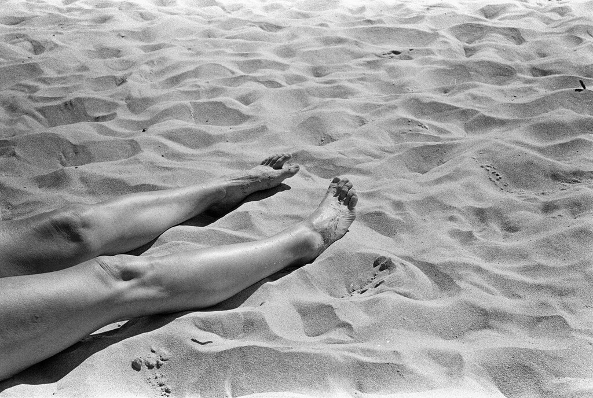

I finally got around to updating Hugo's image_render.html so that I can use normal Markdown for images rather than a Hugo shortcode. I used the version from [Alec's blog](https://alecsargent.codeberg.page/notes/hugo/) and it seems to work great. Here's an example:

----

Markdown-mode in Emacs can hide markup so things feel a bit more WYSIWYG, but I've turned that off by default. Don't WYSIWYG Markdown editors sort of defeat one of the purposes of Markdown? Plus, I don't get confused about what is actually in the post this way. I can see the URL for links without `C-c C-l`-ing all the time.

----

