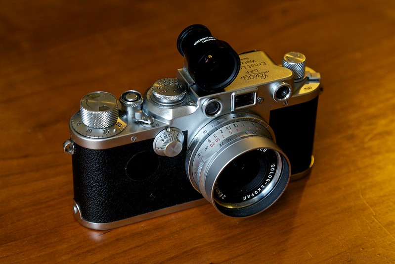

It's a pain finding a photo for every daily journal post, but reviewing my catalog helps remind me that I enjoy photography and have made many photographs that are interesting to me. It acts as a tiny bit of inspiration each day. For today's photo, it's the guy in a suit talking on the phone while leaning against the wall. It was taken using my 1946 Leica IIIf, which is adorable.

----

Guess what. I thought about quitting Emacs again yesterday. Went so far as to re-install Obsidian. After a few hours of new-shiny-this-is-way-easier, I  remembered I can't stand using Obsidian. I do this once every month or two and I never learn.

----

Speaking of being back. I'm doing a daily post here, today. I've been enjoying using Tinderbox to publish the [daily blog](https://daily.baty.net) again, but I'm so far into my Linux experiment that I get twitchy using software that limits me to using a Mac. At least when there are alternatives that I also enjoy using.

----

Why didn't I think of doing this with my HHKB? https://medium.com/lim-less-is-more/sonshi-style-a-style-of-putting-keyboard-on-laptop-67f0a825a53c

----

How crazy is [this](https://wordpress.org/news/2026/03/announcing-my-wordpress/)? WordPress running locally, in-browser.

