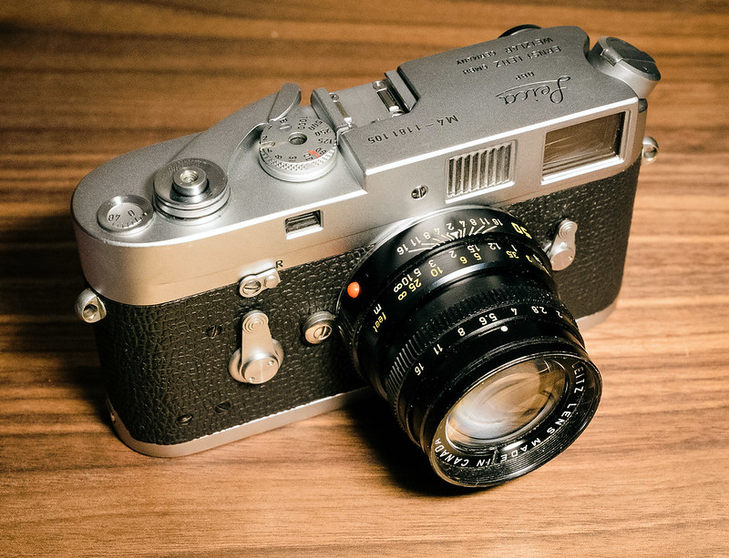

Whenever I test a new blogging tool or return to an old one, I'm reminded that there are things I need to relearn or rebuild. Everything has specific requirements. Doing this can be fun. It makes me feel like I'm accomplishing something. Or, more precisely, it helps me pretend I'm accomplishing something. This Hugo blog has been feature-complete for a while. Creating and editing posts with Emacs is a no-brainer. I've got little functions and helpers and snippets for everything I need. So, while blogging using various platforms is fun and reduces boredom, it's anything but productive. I get tired of both Emacs and Hugo sometimes, but I'd love to stick with them and be done with it. If only, right?

...10 minutes later... https://baty.blog/im-so-moody-when-it-comes-to-blogging

----

The photo for this post was taken using a Leica M4. This one...

It had M3-style levers, a recent and expensive CLA by Sherry Krauter, custom framelines, and it worked perfectly. I sold it because I wanted the money for some stupid digital camera that I no longer have. This was a terrible mistake. Never sell a Leica unless you absolutely have to.
