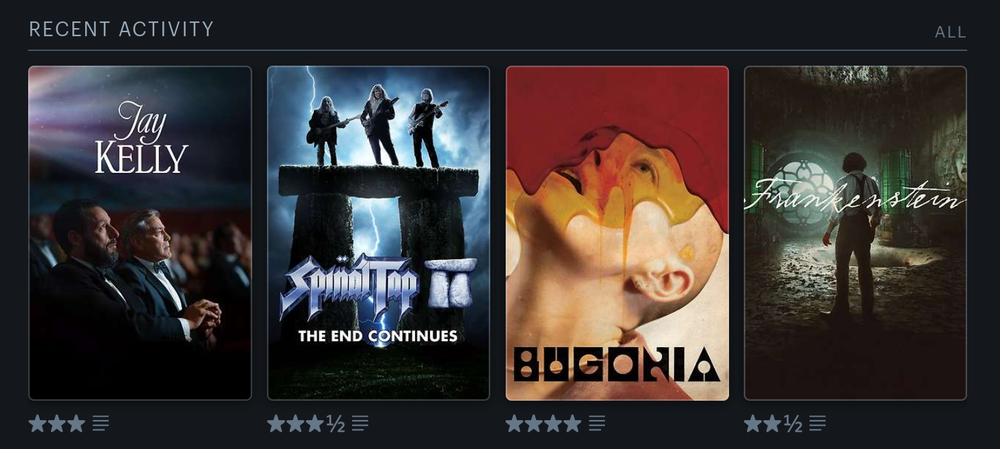

# What I'm doing Now

Here are a few things I’m doing or learning or playing with these days[^thx]

Updated on Sunday, January 4, 2026.

- Very close to going all-in with Linux (Currently KDE on Fedora)
- Learning to use Darktable to process photos.
- Testing [Sublime Text](https://www.sublimetext.com/) on Linux since I can't have BBEdit

## Watched Recently

## Reading

- _Metamorphasis_ by Franz Kafka
- _The Python Years_ by Michael Palin
- *A Manifesto for World Revolution* from Adbusters ([link](https://subscribe.adbusters.org/products/a-manifesto-for-world-revolution?ref=brilliantcrank.com))

[^thx]: (Thanks to [Derek Sivers](https://sive.rs/) for the idea of [keeping a /now page](https://nownownow.com/about) like this one.)