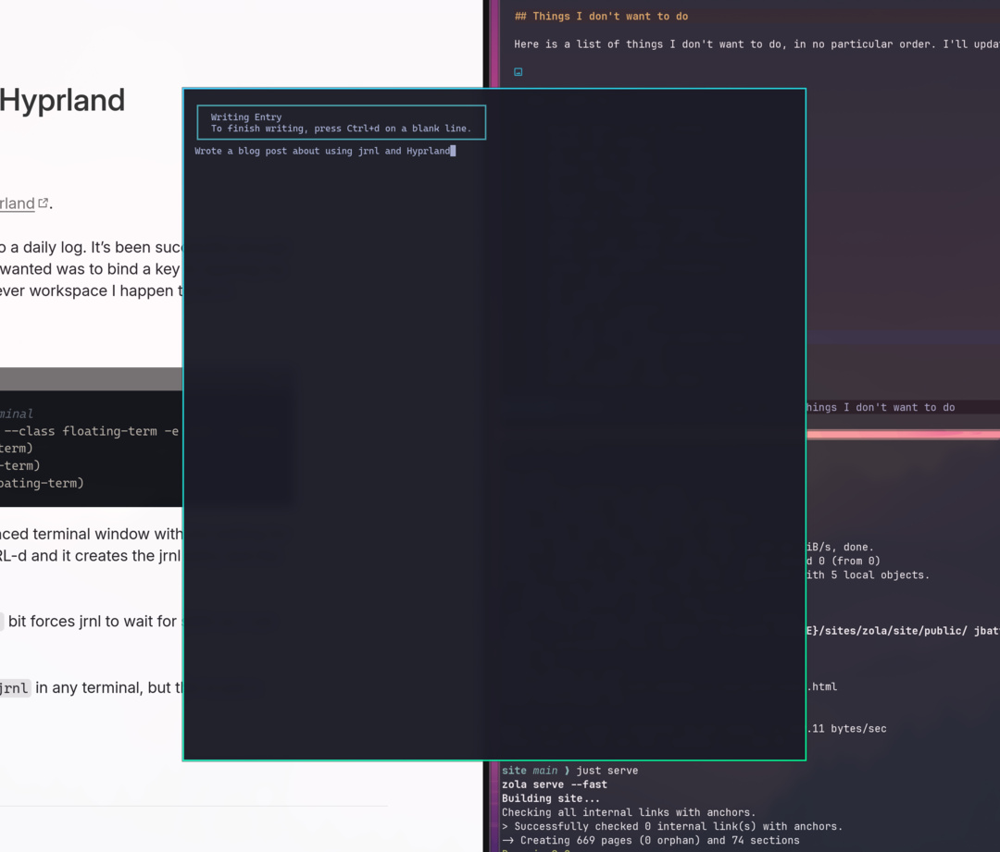

+++
title = "Popup jrnl window in Hyprland"
date = 2025-11-02 06:18:01-05:00
slug = "popup-jrnl-window-in-hyprland"
description = "Making it easier to quickly create entries in `jrnl` using a floating popup window"
[taxonomies]
tags = ["Linux"]
+++

I'm slowly learning how to customize [Hyprland](https://hypr.land/).

I've been playing with [jrnl](https://jrnl.sh/en/stable/) as a way to do a daily log. It's been successful enough that I wanted to streamline it a bit. What I wanted was to bind a key to opening my jrnl prompt in a floating terminal in whichever workspace I happen to be in.

Here's how I did it:

```sh
# Keybinding for floating centered terminal
bind = SUPER SHIFT, J, exec, alacritty --class floating-term -e jrnl --config-override editor ""
windowrulev2 = float, class:(floating-term)
windowrulev2 = center, class:(floating-term)
windowrulev2 = size 800 60%, class:(floating-term)
```

This gets me a conveniently sized and placed terminal window with jrnl waiting for me to type whatever I want. A simple CTRL-d and it creates the jrnl entry and the window goes away.

The `jrnl --config-override editor ""` bit forces jrnl to wait for stdin so I can just start typing.



It may be overkill, since I could just type `jrnl` in any terminal, but this is just a smidge more convenient.
