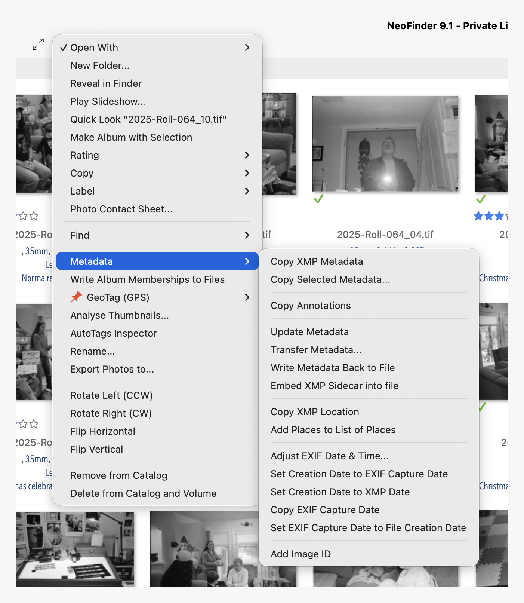

+++
title = "NeoFinder as photo catalog on macOS"
date = 2025-12-05 08:05:53-05:00
slug = "neofinder-as-photo-catalog-on-macos"
description = "I thought I'd revisit NeoFinder as my photo catalog. I'm glad I did."
tags = ["Software", "Photography"]
+++

On macOS, I prefer [Capture One](https://www.captureone.com/en) as my RAW editor, but C1's cataloging features are weak. Plus, I'd prefer not having my catalog and editor so tightly tied together. I'd love to get out of the Adobe ecosystem, so I don't want to get too deep into using Lightroom Classic for my catalog. [Photo Mechanic](https://home.camerabits.com/tour-photo-mechanic/) is great, but has gotten too expensive.

I thought I'd revisit [NeoFinder](https://cdfinder.de/index.html). I'm glad I did.

NeoFinder is really good at keeping track of all kinds of media on all kinds of storage. I've put 2025's photos and some other projects into it as a test, and it's impressive. Also, the app just turned 30 years old, so, [Lindy Effect](https://en.wikipedia.org/wiki/Lindy_effect).

There are all kinds of handy tools to manage photo metadata. Here's just one menu:

Oh, and it's inexpensive ($39.99) with no subscription required.

My current plan is to catalog _everything_ using NeoFinder, then export the edited keepers to my [Immich](https://immich.app/) instance for sharing/faces/albums.

I considered using [digiKam](https://www.digikam.org/) for this, as it's nicely cross-platform, but I don't think it'll cut it for the whole catalog. There are some nice tools built into digiKam, so it will remain in the toolbox.

The next step is to move everything out of iCloud Photos into Immich. That's a whole 'nuther project.

