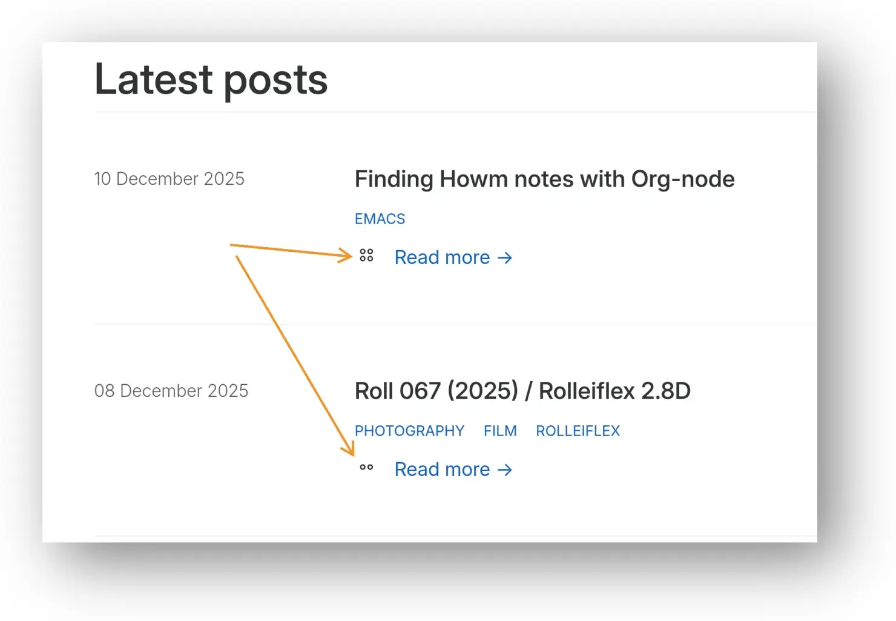

+++
title = 'Adding an article length indicator to the blog'
date = 2025-12-11 04:53:50-05:00
slug = "added-an-article-length-indicator"
tags = ["Blogging","Zola"]
+++

[Tinderbox](https://eastgate.com/Tinderbox) has a great feature that indicates the size of a note using a tiny icon next to each note. This makes it easy to see which notes are long or short at a glance.

I've tried to recreate that here, since at first glance every post is the same. I would have gone with the built-in method by showing the word count, but that takes work to read; 250 and 550 look the same at a glance .

Instead, I place one of three small icons next to each post.

**𐄚** = quick read (<200 words)    
**𐄜** = medium read (200-500 words)    
**𐄞** = longer read (>500 words)    

I'm not sure those are the right limits, so I'll tweak them if it feels wrong.

It looks like this:

I realize it's not self-explanatory. It probably should be, but I didn't want to add clutter. If you know, you know, I guess.

So much for not futzing with the Zola templates 🤷‍.

