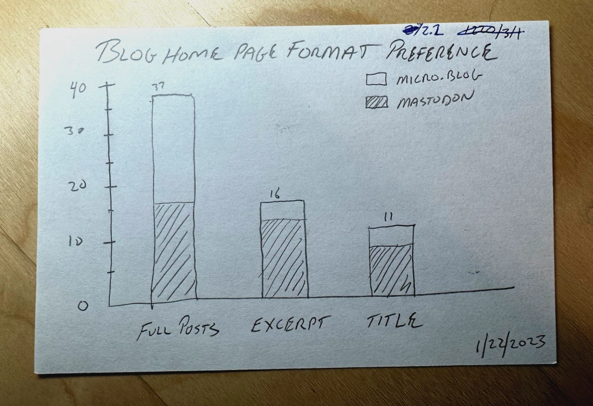

+++
title = 'I think I want a new theme'
date = 2025-12-28 06:14:41-05:00
slug = "i-think-i-want-a-new-theme"
tags = ["meta"]
+++

> [!NOTICE] Update: I went with something else :)

A few years ago, I wanted to know what type of home page layout people preferred for a blog. The options where:

1. Full posts
2. Title and Excerpt
3. Title only

The results looked like this:

 

Personally, I agree, full posts are best. Especially when there's a way to truncate a very long post with a "more..." link. For some reason, though, theme makers seem to think that the other two options are preferable. I have never found a theme I liked for Hugo or Zola or Eleventy or any of them that show full posts in a simple way. This is why I keep glancing over at [baty.blog](https://baty.blog), which is currently running on [Blot](https://blot.im). I like the theme, and I like how Blot works.

Thing is, that's not my _real_ blog. This blog at baty.net is my real blog. It's the one people read and subscribe to. I could probably guide people over to baty.blog, but why? I could maybe migrate everything to Blot and run that at baty.net, but that almost guarantees a bunch of broken stuff, so I'm reluctant to do that. Besides, I have a thing for static sites, and while Blot starts out as just Markdown files, it's still a hosted, rendered service.

 [Tabi](https://github.com/welpo/tabi) is a nice theme, but it's a "title and excerpt" thing. What I really want is a new theme that works for all types of posts. The closest I've come is with the [daily.baty.net](https://daily.baty.net) blog. I like the way it collects things by day. I like that I can write long and short posts and they both "fit". I like that I can even write some things that aren't part of the RSS feed.

    Maybe Claude could translate that theme for use with Zola or Hugo. I feel like that would be frustrating, though. Or maybe I'll do the move-everything-to-blot thing. I dunno.

What I may do is take another look around at themes and see if I can find a suitable one. Recommendations are welcome!
