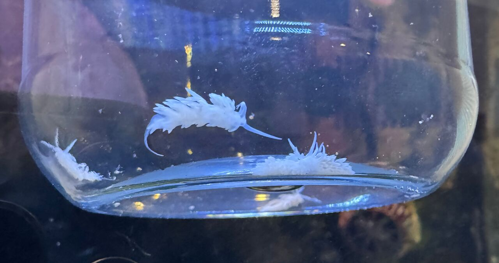

My reef tank continues to confound all efforts to make it pretty. 

The most pressing problem is a serious outbreak of [Aiptasia](https://en.wikipedia.org/wiki/Aiptasia). I've been unable to keep up with it using chemical methods[^1]. The most common non-chemical suggestion is to introduce [Berghia Nudibranch](https://en.wikipedia.org/wiki/Berghia) into the tank. The only thing these "sea slugs" eat is Aiptasia.

My tank is only 32 gallons, so I ordered six slugs. The medium ones (1/2-3/4 inch in length) run about $17 each. The expensive part was shipping. They must be shipped overnight, so shipping was $56. Yeesh.

They arrived yesterday and I began to drip-acclimate them. Once acclimated, I placed their jar on its side on a live rock. They all eventually crawled out onto the rock in about two hours. They immediately disappear into crevasses and holes in the rock. They are nocturnal and remain hidden most of the time, so it's likely I'll never even see them again.

I'm told it can take months for them to seriously dent the Aiptasia population, so now I wait.

[^1]: Mainly, dosing each one individually with Aiptasia-X
