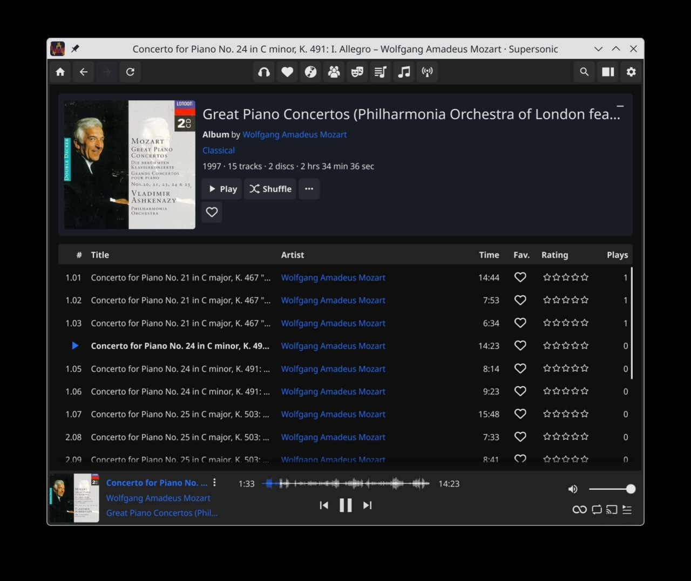

I've been running [Navidrome](https://www.navidrome.org/) on the NAS for a few weeks as a way to avoid figuring out how to use Roon on Linux. Navidrome is no Roon, but it's fast and simple and works well enough for my purposes.

Navidrome's web UI is fine, but I thought I'd look for a "real" (Linux) client for it. Navidrome's API is compatible with the OpenSubsonic API, which apparently is quite popular, so there are  [many options](https://www.navidrome.org/apps/). I've started with [Supersonic](https://github.com/dweymouth/supersonic).

I don't tinker with my music clients much. I listen to complete albums only and almost never use playlists.

Supersonic as a front end to Navidrome is working great so far.

