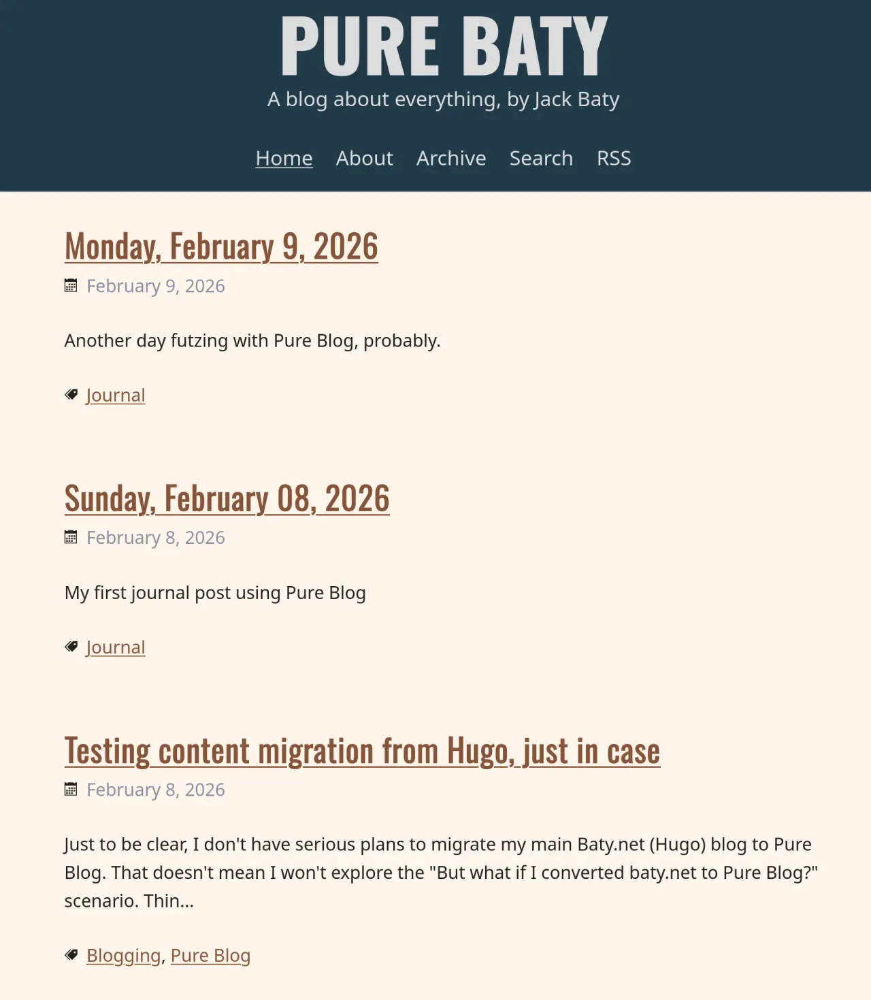

At the beginning of the year, I jokingly resolved that I wouldn't change my blog platform more than once every three months. Technically, I've kept my word. But last week [Kev Quirk introduced](https://kevquirk.com/introducing-pure-blog) his new blogging platform, [Pure Blog](https://pureblog.org). I am constitutionally unable to resist trying new blogging platforms, so I set up a copy and started tinkering.

It's nice! It's not technically an SSG (it uses PHP), but it maintains content as YAML-fronted Markdown files, just like most SSGs. What attracted me most, originally, was that the whole thing felt like something I'd build, given the time and talent. It focused on the things I find important, so it was a good fit right off the bat.

Here's mine, so far. I'm playing with fonts and colors a bit. Currently, it mimics my [Emacs theme, ef-day](https://github.com/protesilaos/ef-themes/).

Without too much fuss, Pure Blog behaves the way I want a blog to behave. It's simple, yet complete for what I need. I do have a wishlist, though.

- Footnote support
- Header improvements (such as making the blog title clickable or otherwise customizable)
- I'd like to override the Copyright text.
- A built-in /archive page with compact list of all posts, different from that of the home page. (I've made my own basic version)
- Possibly an easier upgrade mechanism. I'm using a [custom justfile](https://pure.baty.net/managing-pure-blog-updates-using-just) but it's fragile. Kev's instruction for upgrades are close, but miss things like /content/layouts/, which are technically code, not content. And custom CSS is edited using the admin panel, which makes that also content, not code. It's not onerous now, but I have to pay more  attention than I'd like.

In fairness, the whole project was meant to scratch a particular itch for one person. I'm not complaining! Like I told Kev, "Can open, worms everywhere!" :)

But now what? Part of me wants to break my rule and move baty.net to Pure Blog. That would be an enormous project, because years of using different tools has brought a variety of front matter formats (TOML, YAML, dates, tags, etc).

Another option is to make a new blog, such as I have so far with [pure.baty.net](https://pure.baty.net), but even though the domain is fitting and kind of funny, I think the novelty will wear off.

I'm thinking about replacing baty.blog with a fresh new Pure Blog and leaving the old site behind. I have the [content saved](https://blot.baty.net), so while it'll break links, at least the content is still out there somewhere.

Anyway, Kev's made a nifty, simple, useful, and easy-to-host blogging tool with Pure Blog. I need to figure out what to do with it.
